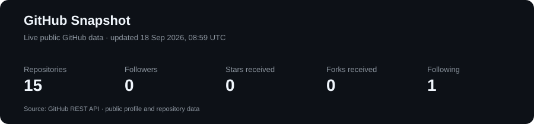
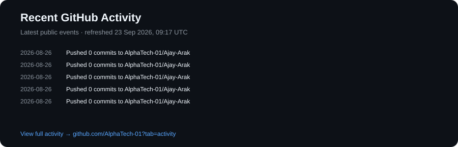

# 👋 Hi, I'm Ajay Rajendra Arak

### `Flutter Developer` · `Mobile & Web Engineer` · `API & Real-Time Systems`

<p align="center">
  <a href="https://github.com/AlphaTech-01?tab=followers"></a>
  <a href="https://github.com/AlphaTech-01?tab=repositories"></a>
</p>

<p align="center">
  <b>Building production applications • integrating systems • debugging what breaks • shipping what matters</b>
</p>

---

## ⚡ What I'm Doing

```text
📱 Flutter / Dart          → Android · iOS · Web
🔌 APIs & Backend          → REST · Node.js · Firebase
⚡ Real-Time               → WebSocket · Live Tracking
🎥 Communication           → VideoSDK · WebRTC
🤖 AI Integration          → Vedika AI · Conversational UI
📊 Analytics               → BigQuery · Event Tracking
☁️ Cloud                   → Firebase · GCP · AWS · Azure
🧪 Engineering             → Testing · Debugging · Git · Agile
```

> I currently work on a live healthcare technology platform, contributing across the User App, Provider App, Web, and Admin systems.

---

# 🧑‍💻 About Me

- 💼 **Flutter Developer Intern @ Vedika HealthTech**
- 🗓️ Working on production systems since **March 2026**
- 📱 Building for **Android + iOS + Web**
- 🏥 Working across **Doctor Consultation, Ambulance, Medicine Ordering, Health Records & Vedika AI**
- 🔌 Integrating and developing **REST APIs**
- ⚡ Building **WebSocket-based real-time experiences**
- 🎥 Working with **VideoSDK / WebRTC**
- 📊 Building analytics features with **BigQuery**
- 🐛 Enjoying the part of development where **"it works on my machine" isn't enough**
- 🚀 Interested in **mobile engineering, backend systems, AI products, real-time applications and cloud**

---

# 📊 GitHub Activity

<p align="center">
  
</p>

<p align="center">
  
</p>

> **Stable live cards:** generated inside this repository from the GitHub REST API and refreshed automatically by GitHub Actions.

### 🔎 Explore More

[Repositories](https://github.com/AlphaTech-01?tab=repositories) · [Activity](https://github.com/AlphaTech-01?tab=activity) · [Contribution Graph](https://github.com/AlphaTech-01)

---

# 🛠️ Tech Stack

### 📱 Mobile & Frontend

<p>


</p>

### 🔌 Backend & APIs

<p>


</p>

### ☁️ Firebase, Cloud & Analytics

<p>


</p>

### 🤖 AI / ML

<p>


</p>

### 🧰 Engineering Tools

<p>


</p>

---

# 🚀 Featured Work

## 🏥 Vedika Healthcare Platform

**Flutter · Dart · React · REST APIs · WebSocket · VideoSDK · Firebase · BigQuery**

A production healthcare platform spanning **Doctor Consultation, Ambulance Booking, Medicine Ordering, Health Records and Vedika AI** across Android, iOS and Web.

**Built / contributed to:**

- 📱 Cross-platform production features
- 🍎 Platform-adaptive iOS UI using Cupertino patterns
- 🔌 REST API integrations across multiple product modules
- ⚡ WebSocket live updates and tracking
- 🗺️ Google Maps and route visualization
- 🎥 VideoSDK / WebRTC communication
- 🤖 Vedika AI conversational experience
- 📊 BigQuery analytics and event tracking
- 🧪 Cross-platform regression testing
- 🐛 Production debugging and root-cause analysis

---

## 🤖 Multi-Language Abstractive Summarization

**Python · Hugging Face · IndicBART · mT5 · Streamlit**

Built a multilingual NLP system supporting Indian regional languages using transformer-based models.

- Transformer-based abstractive summarization
- ROUGE / BLEU evaluation
- Python ML pipeline
- Interactive Streamlit demonstration

---

## 📈 Customer Churn Prediction

**Python · Scikit-learn · Machine Learning · Streamlit**

Built a classification pipeline for customer churn prediction with preprocessing, feature engineering and an interactive visualization dashboard.

---

# 🧩 Engineering Mindset

```text
Requirement
    ↓
Design
    ↓
Implement
    ↓
Integrate
    ↓
Test
    ↓
Debug
    ↓
Measure
    ↓
Improve
    ↓
Ship 🚀
```

I like working at the intersection of:

**Mobile × Backend × AI × Real-Time × Cloud**

---

# 🔥 Current Focus

<table>
<tr>
<td>📱 <b>Flutter</b><br/>Cross-platform architecture</td>
<td>⚡ <b>Real-Time</b><br/>WebSocket & WebRTC</td>
<td>🤖 <b>AI</b><br/>AI-powered product experiences</td>
</tr>
<tr>
<td>🔌 <b>APIs</b><br/>REST & backend integration</td>
<td>📊 <b>Analytics</b><br/>BigQuery & event tracking</td>
<td>☁️ <b>Cloud</b><br/>GCP · AWS · Azure</td>
</tr>
</table>

---

# 📚 Currently Learning / Exploring

- 🧠 AI-powered application architecture
- ☁️ Cloud architecture and infrastructure
- ⚡ Scalable real-time systems
- 🔐 Production API reliability
- 📊 Data-driven product engineering
- 🧩 Better Flutter architecture and reusable components
- 🛠️ Developer automation and CI/CD

---

# 🏆 Engineering Highlights

| Area | Experience |
|---|---|
| 📱 Platforms | Android · iOS · Web · Desktop |
| 🧱 UI Architecture | Reusable adaptive Flutter widgets |
| 🔌 APIs | REST API integration + API development |
| ⚡ Real-Time | WebSocket · Live tracking |
| 🎥 Communication | VideoSDK · WebRTC |
| ☁️ Cloud | Firebase · GCP · AWS · Azure |
| 📊 Analytics | BigQuery · Event Tracking |
| 🤖 AI | Vedika AI · Transformers · ML |
| 🧪 Quality | Regression testing · Production debugging |
| 🔀 Workflow | Git · GitHub · Agile |

---

# 📫 Let's Connect

<p align="center">
  <a href="mailto:arakrajendra2@gmail.com">
    
  </a>
  <a href="https://www.linkedin.com/in/ajay-arak6751">
    
  </a>
  <a href="https://github.com/AlphaTech-01">
    
  </a>
</p>

---

## 🎓 Education

**Bachelor of Technology — Information Technology**  
Vishwakarma Institute of Information Technology (VIIT), Pune  
**2022 – 2026**

**Certifications**
- AWS Academy — Fundamentals of Architecting on AWS
- IBM Full Stack Software Developer Professional Certificate — Coursera

---

<p align="center">
  <i>Build with purpose. Debug with patience. Ship with confidence.</i>
</p>

<p align="center">
  <b>Thanks for visiting! ⭐ Feel free to explore my repositories.</b>
</p>
